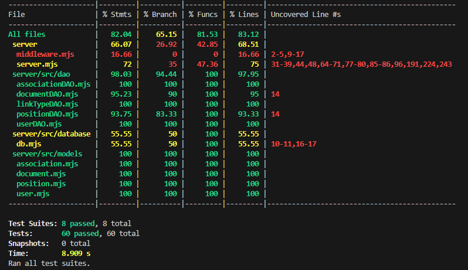

TEMPLATE FOR RETROSPECTIVE (Team #20)
=====================================

The retrospective should include _at least_ the following
sections:

- [process measures](#process-measures)
- [quality measures](#quality-measures)
- [general assessment](#assessment)

## PROCESS MEASURES

### Macro statistics

- Number of stories committed vs. done

      We committed 4 stories and all of them are done 

- Total points committed vs. done

      We committed 6 points and we done all of them.

- Nr of hours planned vs. spent (as a team)

      Hours planned 96 and we spent 96 hours sharp.

**Remember**a story is done ONLY if it fits the Definition of Done:

- Unit Tests passing
- Code review completed
- Code present on VCS
- End-to-End tests performed

> Please refine your DoD if required (you cannot remove items!)

### Detailed statistics

| Story        | # Tasks | Points | Hours est. | Hours actual |
|--------------|---------|--------|------------|--------------|
| _#0_         |   12    |    -   |  58h       |  55h 35m     |
| KX-1         |   6     |    2   |  10h 30m   |    9h 30m    |
| KX-2         |   6     |    1   |   9h       |   12h 25m    |
| KX-3         |   6     |    1   |   7h       | 7h  55m      |
| KX-4         |   6     |    2   |   11h 30m  |   10h 35m    |

    To be noted:
    1 - _#0_ has been intendend as "uncategorized cards" (our project-setup phase)

> story `#0` is for technical tasks, leave out story points (not applicable in this case)

    The standard deviation has been evaluated with: 

  $$\sigma = \sqrt{\frac{1}{N} \sum_{i=1}^{N} (x_i - \mu)^2}$$
  > where:

- $\sigma$: standard deviation
- $x_i$: i-th hour estimated/actual
- $\mu$: hours per task average estimated/actual
- $N$: # of task, in this case 36 (#0, KX-1, KX-2, KX-3, KX-4)

- Hours per task average, standard deviation (estimate and actual)

      Hours per task average (estimated): 2h 40m (2.667h) 
      Standard deviation (estimated): 3h 17m  (3.28h)

      Hours per task average (actual): 2h 40m (2.667h)
      Standard deviation (actual): 3h 11m (3.18h)

- Total estimation error ratio: sum of total hours spent / sum of total hours effort - 1

  $$\frac{\sum_i spent_{task_i}}{\sum_i estimation_{task_i}} - 1$$
  > Result: 0

- Absolute relative task estimation error: sum( abs( spent-task-i / estimation-task-i - 1))/n

  $$\frac{1}{n}\sum_i^n \left| \frac{spent_{task_i}}{estimation_task_i}-1 \right| $$
  > Result: 0.326
  
## QUALITY MEASURES

- Unit Testing:
  - Total hours estimated : 3d
  - Total hours spent : 3d 3h 50m
  - Nr of automated unit test cases : 90
  - Coverage (if available) : white box coverage
    
  
- E2E testing:
  - Total hours estimated : 5
  - Total hours spent : 6
- Code review
  - Total hours estimated : 4
  - Total hours spent : 4.25
  
## ASSESSMENT

- What caused your errors in estimation (if any)?

      We estimated tasks time as a team, but we did not consider the individual's skills and preferences. This led to some team members spending time on learning tasks they were not familiar with.  
      To solve this problem, we should first assign tasks to the team members and then estimate the time required for each task. This way, we can consider the individual's skills and make a more accurate estimation.

- What lessons did you learn (both positive and negative) in this sprint?

      Positive lessons:
      We learned to work on new library (Leaflet).
      Understanding the user stories by designing a prototype and a demo to clarify to the team members what the user stories are about.

      Negative lessons:
      We hat to understand each member's skills and preferences because we did not assign tasks based on individual skills and preferences.
      
- Which improvement goals set in the previous retrospective were you able to achieve?

      We organized the structure of the project by defining database tables and clarifying the overall architecture. We spent more time to design diagrams to visualize project flow and components.
      We also created separate branches for each user story and sub-branches for frontend/backend work.

- Which ones you were not able to achieve? Why?

      We did not focus to achieve improvement in UI/UX because we focused more on the functionality of the project.

- Improvement goals for the next sprint and how to achieve them (technical tasks, team coordination, etc.)

      We will focus on improving the UI/UX of the project.
      We will also try to improve our planning and estimation skills by assigning tasks to team members based on their skills and then estimating the time required for each task.

- One thing you are proud of as a Team!!

      We are proud that, despite the technical challenges, we were able to complete four user stories.
