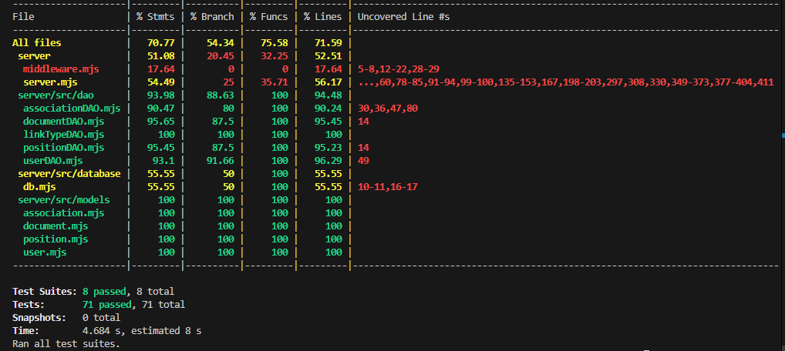

# RETROSPECTIVE Sprint2 (Team #20)

=====================================

## PROCESS MEASURES

### Macro statistics

- Number of stories committed vs. done

      We committed 4 stories and all of them are done 

- Total points committed vs. done

      We committed 6 points and we done all of them.

- Nr of hours planned vs. spent (as a team)

      Hours planned 96 and we spent 96 hours sharp.

**Remember**a story is done ONLY if it fits the Definition of Done:

- Unit Tests passing
- Code review completed
- Code present on VCS
- End-to-End tests performed

> Please refine your DoD if required (you cannot remove items!)

### Detailed statistics

| Story        | # Tasks | Points | Hours est. | Hours actual |
|--------------|---------|--------|------------|--------------|
| _#0_         |   25    |    -   |   59h 55m  |   60h 5m     |
| KX-5         |   7     |    1   |   2h 5m    |   2h 45m     |
| KX-6         |   4     |    2   |   13h 15m  |   12h 30m    |
| KX-7         |   6     |    2   |   13h 15m  |   12h 55m    |
| KX-8         |   3     |    1   |   7h 30m   |   7h 45m     |

    To be noted:
    1 - _#0_ has been intendend as "uncategorized cards" (our project-setup phase)

> story `#0` is for technical tasks, leave out story points (not applicable in this case)

    The standard deviation has been evaluated with: 

  $$\sigma = \sqrt{\frac{1}{N} \sum_{i=1}^{N} (x_i - \mu)^2}$$
  > where:

- $\sigma$: standard deviation
- $x_i$: i-th hour estimated/actual
- $\mu$: hours per task average estimated/actual
- $N$: # of task, in this case 36 (#0, KX-1, KX-2, KX-3, KX-4)

- Hours per task average, standard deviation (estimate and actual)

      Hours per task average (estimated): 2h 8m (2.13h) 
      Standard deviation (estimated): 2h 20mm  (2.34h)

      Hours per task average (actual): 2h 8m (2.13h)
      Standard deviation (actual): 2h 28m (2.47h)

- Total estimation error ratio: sum of total hours spent / sum of total hours effort - 1

  $$\frac{\sum_i spent_{task_i}}{\sum_i estimation_{task_i}} - 1$$
  > Result: 0

- Absolute relative task estimation error: sum( abs( spent-task-i / estimation-task-i - 1))/n

  $$\frac{1}{n}\sum_i^n \left| \frac{spent_{task_i}}{estimation_task_i}-1 \right| $$
  > Result: 0.24
  
## QUALITY MEASURES

- Unit Testing:
  - Total hours estimated : 6h
  - Total hours spent : 7h 50m
  - Nr of automated unit test cases : 71
  - Coverage (if available) : white box coverage
  
- E2E testing:
  - Total hours estimated : 7h 50m
  - Total hours spent : 4h 40m
- Code review
  - Total hours estimated : 7h 30m
  - Total hours spent : 8h

## ASSESSMENT

- What caused your errors in estimation (if any)?

      We encountered some technical challenges that we did not expect, which caused us to spend more time on some tasks than we had estimated.

- What lessons did you learn (both positive and negative) in this sprint?

      Positive lessons:
      We understood each member's skills and preferences and we did assign tasks based on individual skills and preferences, so each person's performance was better than the previous sprint with less stress.

      Negative lessons:
      We tried to focus on improving the UI/UX but because of problems that arise we lacked of time to improve it.
      
- Which improvement goals set in the previous retrospective were you able to achieve?

      We slightly improved our planning and estimation skills by assigning tasks to team members based on their skills. Then we estimated the time required for each task.

- Which ones you were not able to achieve? Why?

      We did not achieve big improvements in UI/UX because we focused more on the functionality of the project.

- Improvement goals for the next sprint and how to achieve them (technical tasks, team coordination, etc.)

      We will focus on improving the UI/UX of the project.
      We should plan the last meeting date earlier so we can have more time to solve problems if they arise before the sprint review.

- One thing you are proud of as a Team!!

      We are proud that, despite the technical challenges, we were able to complete four user stories. We were able to help each other and solve problems together.
