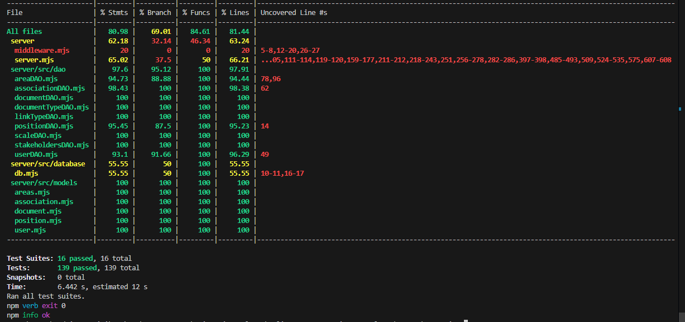

RETROSPECTIVE Sprint 3 (Team #20)
=====================================

The retrospective should include _at least_ the following
sections:

- [process measures](#process-measures)
- [quality measures](#quality-measures)
- [general assessment](#assessment)

## PROCESS MEASURES 

### Macro statistics

- Number of stories committed vs. done

      We committed 2 stories and all of them are done 

- Total points committed vs. done

      We committed 4 points and we done all of them.

- Nr of hours planned vs. spent (as a team)

      Hours planned 96 and we spent 96 hours sharp.

**Remember**  a story is done ONLY if it fits the Definition of Done:
 
- Unit Tests passing 
- Code review completed
- Code present on VCS
- End-to-End tests performed

> Please refine your DoD 

### Detailed statistics

| Story  | # Tasks | Points | Hours est. | Hours actual |
|--------|---------|--------|------------|--------------|
| _#0_   |   30    |    -   |   80h 35m  |      82      |
|  #9    |   9     |    3   |   10h 55m  |   10h 45m    |
|  #19   |   4     |    1   |     4h 30m |    3h 15m    |

   

> place technical tasks corresponding to story `#0` and leave out story points (not applicable in this case)

    The standard deviation has been evaluated with: 

  $$\sigma = \sqrt{\frac{1}{N} \sum_{i=1}^{N} (x_i - \mu)^2}$$
  > where:

- $\sigma$: standard deviation
- $x_i$: i-th hour estimated/actual
- $\mu$: hours per task average estimated/actual
- $N$: # of task, in this case 43 (#0, KX-9, KX-19)

- Hours per task average, standard deviation (estimate and actual)

      Hours per task average (estimated): 2h 14m (2.23h) 
      Standard deviation (estimated): 2h 49m (2.81h)

      Hours per task average (actual): 2h 14m (2.23h)
      Standard deviation (actual): 2h 25m (2.41h)

- Total task estimation error ratio: sum of total hours estimation / sum of total hours spent -1

> 0.45

  
## QUALITY MEASURES 

- Unit Testing:
  - Total hours estimated : 7h 40m
  - Total hours spent : 8h 30m
  - Nr of automated unit test cases : 139
  - Coverage (if available)
   
- E2E testing:
  - Total hours estimated : 1h 30m
  - Total hours spent :  45m
- Code review 
  - Total hours estimated : 1h 30m
  - Total hours spent : 2h 45m
- Technical Debt management:
  - Strategy adopted: 
        >
          - Use a cost/benefit analysis: prioritize fixing high-benefit and low-cost issues

          - Recompute technical debt analysis weekly

          - Add technical debt analyis and managing into sprint planning

          - Assign specific team members to track and prioritize technical debt

  - Total hours estimated estimated at sprint planning : 10h
  - Total hours spent : 9h
  

## ASSESSMENT

- What caused your errors in estimation (if any)?

- What lessons did you learn (both positive and negative) in this sprint?

- Which improvement goals set in the previous retrospective were you able to achieve? 
  
- Which ones you were not able to achieve? Why?

- Improvement goals for the next sprint and how to achieve them (technical tasks, team coordination, etc.)

> Propose one or two

- One thing you are proud of as a Team!!