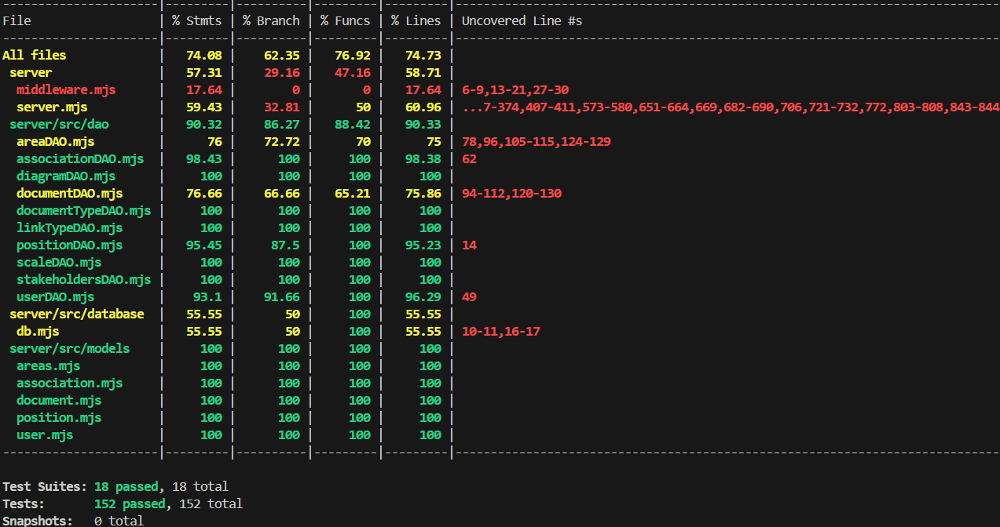

TEMPLATE FOR RETROSPECTIVE (Team ##)
=====================================

The retrospective should include _at least_ the following
sections:

- [process measures](#process-measures)
- [quality measures](#quality-measures)
- [general assessment](#assessment)

## PROCESS MEASURES 

### Macro statistics

- Number of stories committed vs done : 6 committed, 6 done
- Total points committed vs done : 8 committed, 8 done
- Nr of hours planned vs spent (as a team): 96 planned, 96 spent

**Remember**  a story is done ONLY if it fits the Definition of Done:
 
- Unit Tests passing
- Code review completed
- Code present on VCS
- End-to-End tests performed

> Please refine your DoD 

### Detailed statistics

| Story  | # Tasks | Points | Hours est. | Hours actual |
|--------|---------|--------|------------|--------------|
| _#0_   |   18    |    -   |  67h 25m   |  69h 10m     |
| #10    |    6    |    2   |   14h 20m  |  13h 45m     |
| #11    |    1    |    1   |        5m  |       5m     |
| #12    |    4    |    2   |    7h 20m  |    6h 35m    |
| #14    |    4    |    1   |    4h 50m  |    4h 20m    |
| #17    |    4    |    1   |    1h 55m  |    2h        |
| #20    |    1    |    1   |        5m  |       5m     |

   

> place technical tasks corresponding to story `#0` and leave out story points (not applicable in this case)

- Hours per task average, standard deviation (estimate and actual)

|            | Mean | StDev |
|------------|------|-------|
| Estimation |  2.53| 2.6   | 
| Actual     |  2.53| 2.65  |

- Total estimation error ratio: sum of total hours spent / sum of total hours effort - 1

    $$\frac{\sum_i spent_{task_i}}{\sum_i estimation_{task_i}} - 1$$
>
    Result: 0
    
- Absolute relative task estimation error: sum( abs( spent-task-i / estimation-task-i - 1))/n

    $$\frac{1}{n}\sum_i^n \left| \frac{spent_{task_i}}{estimation_task_i}-1 \right| $$

>
    Result = 0.2

  
## QUALITY MEASURES 

- Unit Testing:
  - Total hours estimated: 5h
  - Total hours spent: 5h 35m
  - Nr of automated unit test cases : 152
  - Coverage
   

- Front-end Testing:
  - Total hours estimated: 6h
  - Total hours spent: 7h
  - Nr of automated unit test cases: 19

- E2E testing:
  - Total hours estimated: 3h 30m
  - Total hours spent: 5h 35m
  - Nr of test cases: Not applicable

- Code review 
  - Total hours estimated : 4h 20m
  - Total hours spent : 4h 25m

- Technical Debt management:
  - Strategy adopted:  
  > 
        - Prioritize fixing high-benefit and low-cost issues
        - Add technical debt analyis and managing into sprint planning
        - Assign specific team members to track and prioritize technical debt
        - Learn from past mistakes

  - Total hours estimated estimated:
  >
      Sonarcloud: 10h 
  - Total hours spent: 
    > 
        Sonarcloud: 7h 
  

## ASSESSMENT

- What caused your errors in estimation (if any)?

- What lessons did you learn (both positive and negative) in this sprint?

- Which improvement goals set in the previous retrospective were you able to achieve? 
  
- Which ones you were not able to achieve? Why?

- Improvement goals for the next sprint and how to achieve them (technical tasks, team coordination, etc.)

> Propose one or two

- One thing you are proud of as a Team!!